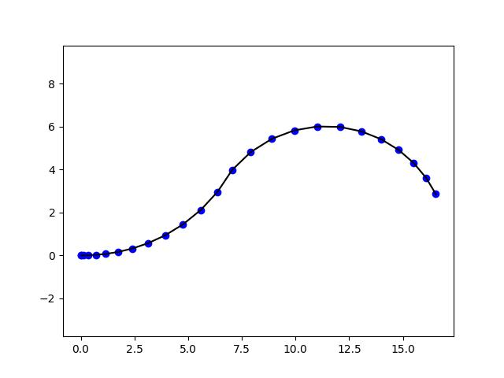
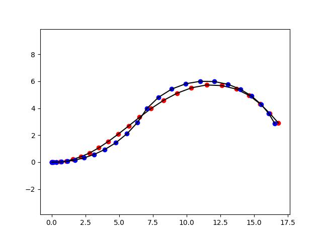
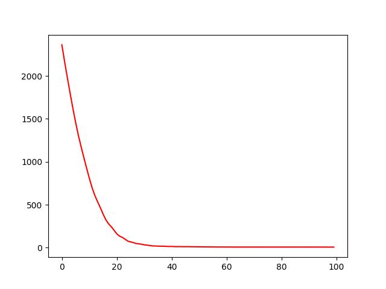

# MPC
Model Predictive Control (MPC) for kinematic bicycle model

This code example demonstrates the use of PyTorch as an optimizer for Model Predictive Control. The program takes a reference trajectory and computes controls for kinematic bicycle model that allow it to follow this trajectory. Optimization is done as a loss minimization via PyTorch by using gradient descent (via AdamW optimizer).

Bicycle model is defined as:
```
# Compute speed
friction = self.speed[i]*self.friction_road + self.friction_air*self.speed[i]*self.speed[i]
self.speed[i+1] = torch.clamp(self.speed[i] + self.dt*(self.accel[i] - friction), 0, self.max_speed)

# Clamp steering control and compute current angular velocity
steering_angle = torch.clamp(self.steering[i], -self.max_steer, self.max_steer)
angular_velocity = self.speed[i]*torch.tan(steering_angle)/self.wheelbase

self.x[i+1] = self.x[i] + self.speed[i]*torch.cos(self.yaw[i])*self.dt
self.y[i+1] = self.y[i] + self.speed[i]*torch.sin(self.yaw[i])*self.dt
self.yaw[i+1] = self.yaw[i] + angular_velocity*self.dt
```
The input to the optimizer is the reference trajectory:


The optimizer computes controls (acceleration and streering) such that realized trajectory (via bicycle model) minimizes L2 loss


L2/MSE loss example:

